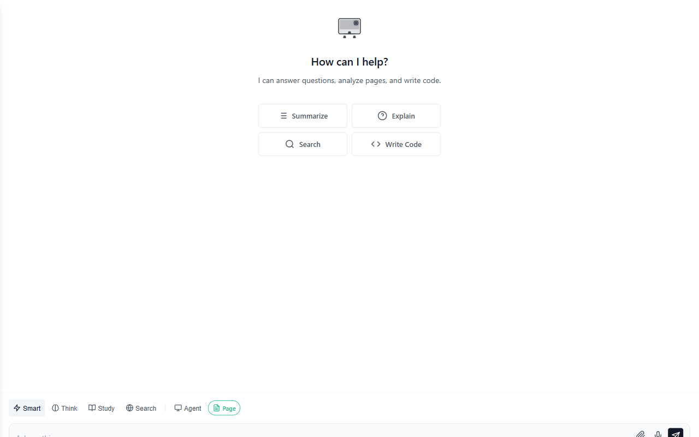

<div align="center">

# CTRL Extension

**An AI agent that lives in your browser — not a chat window bolted onto the side of one.**

CTRL reads the page you're on, writes and runs code, builds slide decks and spreadsheets,
drives the browser itself when you ask it to, and keeps a searchable memory of how you work —
all from a side panel, with the AI provider of your choice.

[](LICENSE)
[](https://github.com/chad-atexpedient/ctrl-extension/actions/workflows/ci.yml)

[](DISTRIBUTION.md)

[Install](#installation) · [What it does](#what-it-does) · [Providers](#bring-your-own-model) · [Docs site](https://chad-atexpedient.github.io/ctrl-extension/) · [Contributing](CONTRIBUTING.md)

<sub> An <b>Expedient AI</b> project</sub>

</div>

---

## See it in action

> **You:** Summarize the open issues on this page, then turn the top 3 into a slide deck.
>
> **Claude:** Found 14 open issues. Top 3 by comment activity:
>
> 1. **Auto-resize breaks on paste** — textarea doesn't grow for multi-line pastes (12 comments)
> 2. **Dark theme badge contrast** — fails WCAG AA on two badge variants (9 comments)
> 3. **`Ctrl+Shift+S` shortcut collision** — conflicts with a common browser binding (7 comments)
>
> Building a 3-slide deck now — opening it in the code pane. Want a tracking issue filed for each one too?

*Claude is shown here as the example model — CTRL talks to it, OpenAI, Gemini, DeepSeek, Groq, or
anything else the same way. See [Bring your own model](#bring-your-own-model).*

<p align="center">
  
</p>

## What it does

- **Context-aware chat** — pull in the current page or a text selection so you're never
  explaining what you're looking at
- **Browser agent** — a Chrome DevTools Protocol–driven agent that can navigate, click, type,
  screenshot, and fill in forms, with an explicit approval step before anything it does could
  change something
- **20+ built-in tool skills** — a code interpreter, Excel/CSV/JSON tools, slide deck and
  document generation, chart building, a regex tester, a web scraper, git automation, PDF
  tools, and more, all callable straight from chat
- **MCP client** — connect Model Context Protocol servers for still more tools without waiting
  on us to build them in
- **Slash commands & prompt snippets** — `/summarize`, `/explain`, `/slides`, `/mvp`, `/code`,
  plus a full command palette (`Ctrl+K`) and reusable snippet triggers
- **Real conversation memory** — searchable, taggable, pinnable history with export/import, not
  a chat log that vanishes when you close the panel
- **24+ themes** — light, dark, cinematic, terminal, and more, plus a compact density mode
- **Bring your own model** — your API key is encrypted (AES-256-GCM) and stored locally; it's
  never sent anywhere except the provider you chose

## Bring your own model

CTRL doesn't sell you tokens — connect the provider you already use:

| Provider | Notes |
|---|---|
| **Anthropic (Claude)** | Claude 4.5, Claude 4 |
| OpenAI | GPT-5o, GPT-4o, o1 |
| Google Gemini | 2.5, 2.0, 1.5 |
| DeepSeek | V3, R1 |
| Groq | Mixtral, Llama |
| OpenRouter | multi-provider routing |
| Mistral, z.ai, MiniMax, Alibaba (DashScope), Meta | and compatible custom endpoints |
| Local | Ollama, LM Studio, or anything OpenAI-compatible on `localhost` |

## Installation

CTRL isn't on a store yet — install it from source:

1. Clone this repository (or download and unzip it)
2. Open `chrome://extensions` (or the Firefox/Safari equivalent — see
   [DISTRIBUTION.md](DISTRIBUTION.md) for per-browser packaging)
3. Enable **Developer mode**
4. Click **Load unpacked** and select the project folder
5. Open the side panel (toolbar icon, or `Alt+Shift+A`) and add an API key when prompted

## Security & privacy, briefly

- API keys are encrypted with AES-256-GCM before they touch disk
- A strict extension-wide Content Security Policy, plus DOMPurify-sanitized rendering for
  everything the model outputs
- AI-generated previews (slide decks, mini web apps, reports) render inside a sandboxed,
  network-isolated iframe — its CSP blocks outbound requests entirely, so generated code can't
  phone home even if it tried
- No analytics, no telemetry, nothing sent anywhere except the AI provider you configured

Full details in [SECURITY.md](SECURITY.md) and [PRIVACY-POLICY.md](PRIVACY-POLICY.md).

## Development

```bash
npm install         # install Playwright dev deps
npm run lint         # static checks (version sync, console.log audit, XSS patterns)
npm test             # 280 unit tests
npm run test:ui      # Playwright E2E (requires `npx playwright install chromium`)
npm run package       # → dist/ctrl-extension-v{ver}.zip for Chrome Web Store
npm run verify        # lint + unit tests in one shot
```

CI runs all of the above on every push and PR via [`.github/workflows/ci.yml`](.github/workflows/ci.yml).

See [CONTRIBUTING.md](CONTRIBUTING.md) for architecture notes and the PR checklist, and
[ARCHITECTURE.md](ARCHITECTURE.md) for a deeper tour of how the pieces fit together.
See [CHANGELOG.md](CHANGELOG.md) for release history.
See [DISTRIBUTION.md](DISTRIBUTION.md) for Chrome, Edge, Firefox, Safari, and GitHub release
packaging details.

## Project layout

```
ctrl-extension/
├── manifest.json          # Extension manifest (Chrome MV3)
├── background/            # Service worker, CDP browser-agent controller
├── sidepanel/              # Main chat UI, agent, sidebar, command palette
├── content/                # Page context extraction (content script)
├── popup/                  # Toolbar quick-actions popup
├── options/                 # Settings page
├── sandbox/                 # Sandboxed iframe for rendering generated previews
├── utils/                   # API client, storage/encryption, skills registry, etc.
│   └── skills/               # The 20+ built-in tool skills
├── platform/                 # Per-browser manifest variants
└── tests/                    # Unit (node:test) + Playwright E2E specs
```

## License

MIT — see [LICENSE](LICENSE).

---

<sub> Built in-house at <b>Expedient</b>, open sourced under MIT.</sub>
